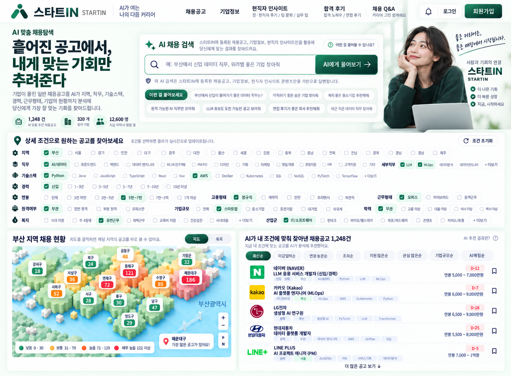
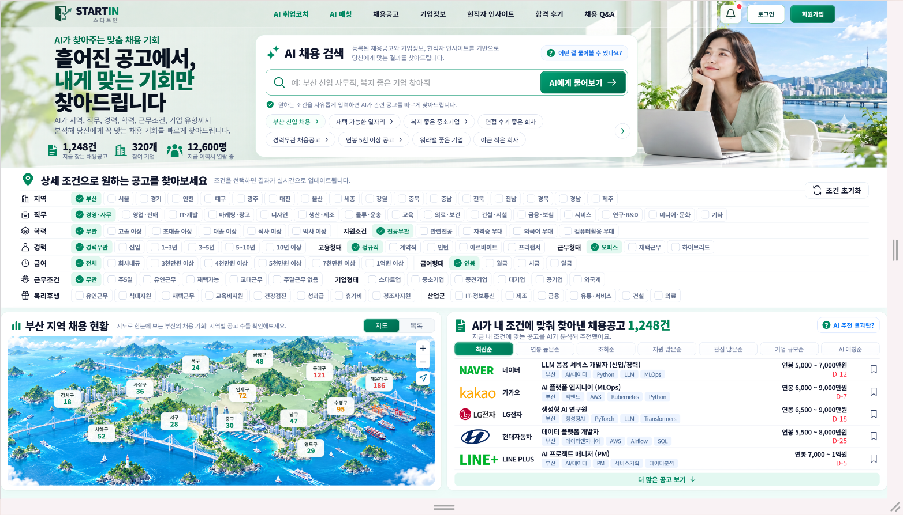
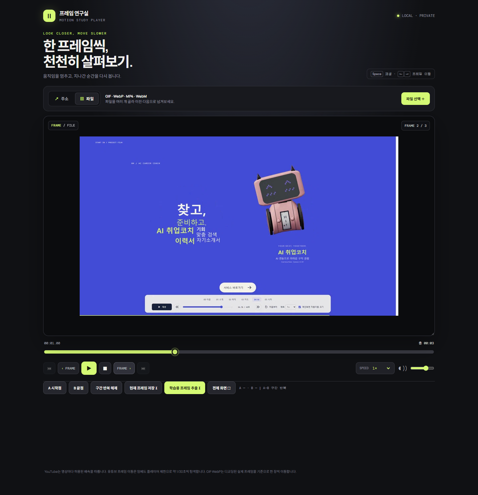
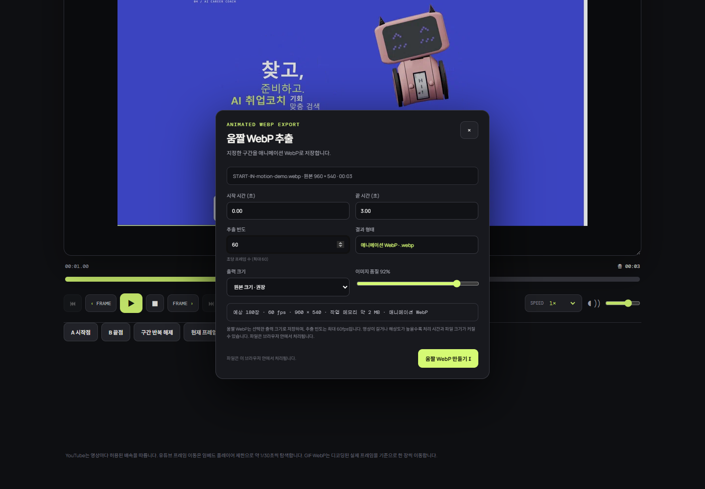
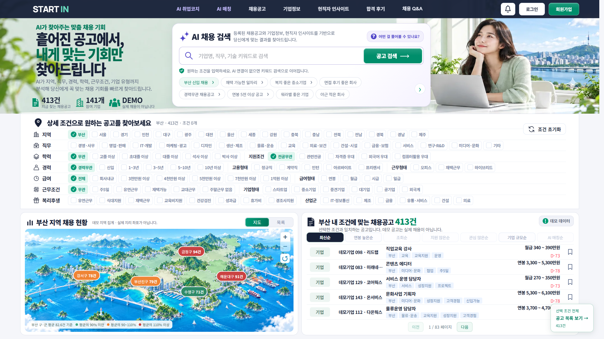

# START IN

> **내 조건에 맞는 채용시장을 빠르게 살펴보는 구직 탐색 프로젝트.**

구직사이트를 열면 정보는 많지만, 정작 원하는 조건의 공고까지 가는 길은 길게 느껴졌습니다. START IN은 **지역과 조건을 고르고, 결과를 확인한 뒤 가볍게 나갈 수 있는 화면**을 목표로 만들었습니다.

출퇴근하고 싶은 지역에는 어떤 일이 많은지, 직무나 급여 조건을 더하면 선택지가 얼마나 줄어드는지 지도와 공고 목록으로 함께 확인할 수 있습니다. React·FastAPI·DB를 연결하며 화면 설계부터 API, 인증, 배포까지 경험한 학습·포트폴리오 프로젝트입니다.

<a href="https://start-in-web.onrender.com/"> 배포 웹사이트 바로가기</a>

## 프로젝트가 발전한 과정

### 01 · 아이디어와 방향 — 2026.09.18

추석 연휴에 지금까지 배운 기술을 연결해 하나의 프로젝트를 만들어보기로 했습니다. 처음에는 AI 추천과 분석 기능을 생각했지만, **살고 싶은 지역 주변에 어떤 일이 많은지**를 먼저 보여주는 방향을 잡았습니다.

기능을 많이 보여주기보다 검색까지 빠르게 도달하고, 필요한 결과를 확인한 뒤 부담 없이 나갈 수 있는 구직사이트를 목표로 정했습니다. 프로젝트 이름에는 시작하는 장소를 뜻하는 `START IN`과 시작하는 사람을 뜻하는 `START 人`을 함께 담았습니다.

### 02 · HOME 1차 디자인 — 2026.09.19



처음으로 사이트의 형태를 잡은 HOME 초안입니다. **조건 선택 → 지역별 채용 분포 → 공고 확인**이라는 흐름을 화면에 배치했습니다.

이 단계에서는 세부 기능보다 검색을 어디에 두고, 지도와 공고를 어떻게 함께 보여줄지 정하는 데 집중했습니다.

### 03 · HOME 2차 디자인 — 2026.09.25



1차 디자인을 바탕으로 헤더, 히어로, AI 검색, 상세 필터, 부산 지도, 채용공고 영역을 다듬었습니다. 실제 브라우저에서 여백과 버튼 크기, 글자, 이미지 배치를 반복해서 조정했습니다.

처음의 한 장짜리 시안을 **실제로 조건을 고르고 결과를 살펴볼 수 있는 화면**으로 발전시킨 단계입니다.

### 04 · 화면 뒤에 API와 DB를 연결

HTML·CSS·JavaScript로 만든 화면을 React로 옮기고, FastAPI와 DB를 연결했습니다. 화면에서 조건을 선택하면 API가 데이터를 조회하고 결과를 다시 화면에 보여주는 흐름을 만들었습니다.

이후 회원가입과 로그인, 사용자별 즐겨찾기, 지원현황과 메모, PDF 이력서 관리를 추가했습니다. 자연어로 입력한 조건도 검색에 사용할 수 있도록 연결했습니다.

화면을 구현하는 프로젝트에서 **사용자의 입력과 데이터가 실제로 오가는 서비스**로 범위가 넓어졌습니다.

### 05 · 데모 데이터 확장과 배포

검색과 지도를 충분히 시험할 수 있도록 데모 기업 150개와 채용공고 1,000개를 구성하고, 17개 시·도에 걸쳐 지역별 결과를 확인했습니다. 이 데이터는 실제 기업과 공고가 아닌 기능 검증용 가상 데이터입니다.

Render에 배포한 뒤에는 로컬에서 동작하는 것뿐 아니라 실제 사이트에서 로그인하고, 여러 조건을 바꾸고, 결과를 확인하는 과정까지 점검했습니다.

### 06 · 배포 후 안정성과 사용감 개선

여러 지역을 빠르게 선택했을 때 요청이 몰리는 문제를 수정하고, DB 연결을 불필요하게 오래 점유하지 않도록 다듬었습니다.

필터나 정렬을 바꿔도 화면이 갑자기 위로 이동하지 않게 하고, 스크롤바 변화로 화면이 흔들리는 부분도 조정했습니다. 저장·지원·업로드 결과는 알림으로 안내하고, 신규 지원기록과 기존 기록을 구분했습니다.

기능이 있다는 것에서 한 단계 더 나아가 **반복해서 사용해도 불편하지 않은 화면**을 만드는 데 집중했습니다. 코드 구조와 주석도 다시 읽고 수정하기 편하도록 정리했습니다.

### 07 · 움직이는 입구 제작 — 2026.10.02–05

서비스를 소개하는 첫 모션 커버를 만든 뒤, 참고 모션을 프레임 단위로 관찰하며 인트로를 발전시켰습니다. 로딩에서 시작해 소개·목적·지도·AI·시작의 다섯 장면으로 이어집니다.


GSAP으로 장면을 연결하고, WebGL·Canvas로 글자의 이동과 회전, 잔상과 반동을 구현했습니다. Three.js 로봇도 함께 배치했습니다. 효과를 늘리는 것만큼 글자 사이의 간격, 등장 순서, 시선이 머무는 시간도 조정했습니다.

위 WebP는 최신 배포본의 로딩부터 인트로, 마지막 흰 커튼과 메인 화면 진입까지 담았습니다.

작은 설명은 한 묶음으로 움직이고, 큰 글자는 빠르게 이동한 뒤 잔상과 반동을 남기도록 만들었습니다. 지도 장면에서는 카드의 등장 간격과 설명 위치를 조정했습니다. 마지막에는 흰 커튼을 위로 걷으며 메인 화면으로 이어집니다.

### 08 · 제작에 필요한 도구도 함께 만들기

빠른 움직임을 자세히 비교하려면 천천히 재생하거나 한 프레임씩 멈춰 볼 수 있어야 했습니다. 이 과정에서 **프레임 연구실**이라는 개인용 분석·변환 도구도 제작했습니다.



프레임 이동, 슬로우 재생, 구간 반복으로 움직임을 관찰하고 필요한 구간을 선택할 수 있습니다.



선택한 구간의 크기·품질·프레임 수를 설정해 WebP로 내보냅니다. 개인용 도구이므로 여기에는 자체 시연 자료를 넣은 화면만 소개합니다.

이렇게 만든 효과는 이펙트북에 정리해 다음 모션에서도 다시 꺼내 쓸 수 있도록 했습니다. 인트로뿐 아니라 다음 작업을 위한 도구와 제작 기록도 함께 남겼습니다.

### 09 · 인트로와 서비스의 분위기 연결 — 2026.10.05



인트로에서 메인으로 들어왔을 때 하나의 서비스처럼 느껴지도록 색과 글자를 정리했습니다. 상단 메뉴와 제목에는 네이비를, 검색과 선택에는 그린을 사용했습니다. 보라는 AI 영역에만 조금 더하고, 주요 버튼에는 얇은 하이라이트를 넣었습니다.

로고는 이미지 대신 Manrope 글꼴의 텍스트로 바꿨습니다. 화면이 전환된 뒤 히어로 폭이 갑자기 줄어드는 문제를 수정하고, 서버 연결이 실패했을 때의 안내와 재시도 버튼도 같은 형태로 맞췄습니다.

위 화면은 배포 사이트에서 조회한 데모 공고와 지도를 그대로 캡처했습니다. 처음의 시안에서 출발해, 이제는 **움직이는 소개 화면과 실제 검색 화면이 이어지는 프로젝트**가 되었습니다.

## 현재 주요 기능

- 지역·직무·학력·경력·고용형태·급여·근무조건·기업형태·복리후생 복수 필터
- 지역별 채용 분포 지도와 구·군 다중 선택
- 검색·정렬·페이지 이동과 URL을 통한 검색 상태 복원
- 공고 상세와 기업별 공고 조회
- 자연어 조건 검색
- 회원가입·로그인과 사용자별 즐겨찾기
- 지원현황 관리와 메모
- PDF 이력서 업로드·다운로드·교체·삭제

사용자별 데이터는 로그인한 계정에 맞춰 처리하며, 이력서와 계정정보는 외부 AI 검색 요청에 보내지 않습니다.

## 기술 스택

| 영역 | 기술 |
| --- | --- |
| Frontend | React 19, React Router, Vite, CSS |
| Motion | GSAP, WebGL, Canvas 2D, Three.js |
| Backend | FastAPI, SQLAlchemy, Alembic |
| Database | SQLite, PostgreSQL |
| Test | Playwright, Pytest |
| Deployment | Render |

## 로컬 실행

### Backend

```powershell
python -m venv .venv
.\.venv\Scripts\python.exe -m pip install -r backend/requirements.lock.txt
.\.venv\Scripts\python.exe -m uvicorn backend.app.main:app --host 127.0.0.1 --port 8000
```

로컬 SQLite는 시작 시 필요한 테이블을 준비하며, 비어 있으면 데모 데이터를 입력합니다.

### Frontend

```bash
npm install
npm run dev
```

PowerShell에서 실행 정책 때문에 막히면 `npm.cmd install`, `npm.cmd run dev`를 사용합니다.

- Frontend: `http://127.0.0.1:5173`
- Backend: `http://127.0.0.1:8000`

## 개발 기록

프로젝트를 시작한 이유와 디자인·기능을 바꾼 과정을 남겼습니다. **AI DEVLOG는 ChatGPT의 시점으로 쓴 별도 제작기**입니다.

- [01 · 추석 연휴에 일이 커졌다 · 2026.09.18](docs/AI_DEVLOG.md)
- [02 · 구직사이트인데 왜 강의를 듣죠? · 2026.09.19–09.24](docs/AI_DEVLOG_02.md)
- [03 · React 복습인 줄 알았는데 기업 150개를 만들었다 · 2026.09.25–09.27](docs/AI_DEVLOG_03.md)
- [04 · 테스트는 통과했고 서버는 죽었다 · 2026.09.27](docs/AI_DEVLOG_04.md)
- [05 · 썩세스라는데 왜 멈추는데? · 2026.10.02](docs/AI_DEVLOG_05.md)
- [06 · 인주가 없는 줄 알았다 · 2026.10.02](docs/AI_DEVLOG_06.md)
- [07 · 잔상 배우다가 타이슨이 된 AI · 2026.10.03–05](docs/AI_DEVLOG_07.md)
- [08 · 내 AI가 죽었어요 · 2026.10.03–05](docs/AI_DEVLOG_08.md)

코드 구조는 [코드 읽기 가이드](docs/CODE_STUDY_GUIDE.md), 운영 설정은 [Render 설정 안내](RENDER_COLD_START_FIX.md)에 정리했습니다.

---

**START IN / START 人**
어디에서 시작할 것인가. 시작하는 사람.
