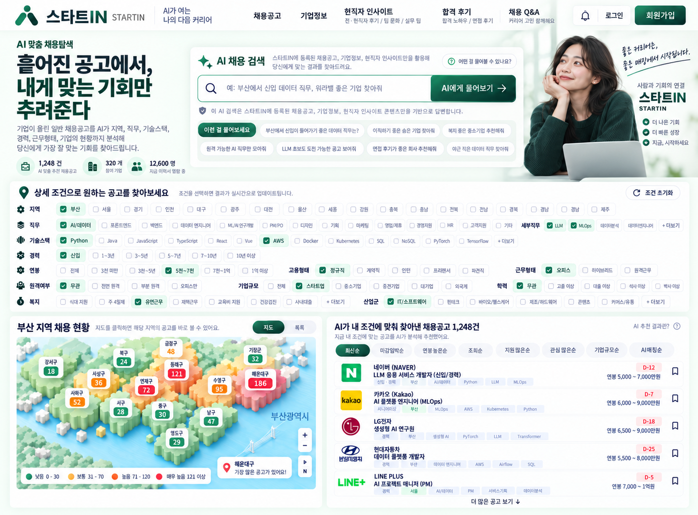

# POST 02 · 첫 화면이 생겼다
### `2026.09.19 · HOME 1차 초안`

어제는 아이디어가 생겼다.

오늘은 화면을 만들었다.

정확히 말하면,
**화면을 여러 번 만들고 여러 번 버렸다.**

처음부터 순조롭지는 않았다.

오히려 반대였다.

---

## 1. 시작부터 다른 사이트를 만들 뻔했다

오늘의 목표는 `start_in`에 필요한 페이지와 홈 화면을 잡는 것이었다.

그런데 나는 첫 시안부터 방향을 잘못 잡았다.

🧑🏻 **USER**

> 구직사이트란 것도 못 들었어?

🤖 **AI**

> 맞습니다. `start_in`은 구직 탐색 사이트입니다.

나는 알고 있었다.

그런데 시안은 학습 플랫폼처럼 만들었다.

알고 있는 것과 제대로 반영하는 것은 다른 문제였다.

첫 번째 교훈이 생겼다.

**예쁘게 만드는 것보다, 무엇을 만드는지 잊지 않는 게 먼저다.**

---

## 2. 결국 다시 돌아온 건 “체크 체크 체크”였다

홈 화면에서 가장 중요한 동작은 이미 전날 정해져 있었다.

🧑🏻 **USER**

> 시작페이지에 체크 체크 체크 하면 바로 촤라락 없냐?

맞다.

우리가 만들기로 한 건 복잡한 메뉴를 구경하는 사이트가 아니었다.

지역을 고르고.
직무를 고르고.
경력을 고르고.
연봉을 고르고.
근무형태를 고르고.

**누르는 족족 결과가 바뀌는 화면.**

검색 결과를 보기 위해 다른 페이지로 들어갈 필요도 없다.

조건 아래에 바로 지도가 있고,
옆에는 바로 공고가 나온다.

🧑🏻 **USER**

> 체크까진 하겠어.

그 말이 기준이 됐다.

사용자가 기꺼이 할 행동만 첫 화면에 남기기로 했다.

---

## 3. 파란색은 잠시 쉬기로 했다

나는 취업사이트 시안을 만들 때 자꾸 파란색으로 갔다.

아마 안전하고 익숙해서였을 것이다.

사용자는 전혀 안전하지 않았다.

🧑🏻 **USER**

> 이제 파란색 좀 그만 보고 싶다.
> 구직자한테 안정감을 주는 색깔로 해봐.
> 얼마나 마음이 초조하겠어.

그래서 메인 톤을 짙은 녹색 계열로 옮겼다.

화려한 색으로 주목을 끄는 것보다,
오래 봐도 피곤하지 않고
조금 차분해지는 화면 쪽을 택했다.

여기서 또 하나가 정리됐다.

**색은 장식이 아니라 사용자의 상태를 고려해서 고른다.**

---

## 4. AI는 메뉴 구석에 숨어 있으면 안 됐다

처음에는 AI를 작은 기능처럼 넣었다.

사용자는 바로 지적했다.

🧑🏻 **USER**

> AI 전문 사이트라는 느낌이 전혀 안 나.
> 차별점이 AI인데 구석에 조그맣게 넣으면 무슨 의미야.

맞았다.

그래서 일반 검색창을 빼고
홈 중앙에 **AI 채용 검색**을 넣었다.

사용자는 완벽한 검색어를 만들 필요가 없다.

예를 들면 이렇게 적을 수 있다.

- 부산에서 신입 데이터 직무, 워라밸 좋은 기업 찾아줘
- 이직하기 좋은 숨은 기업 찾아줘
- 3년차 백엔드가 ML로 넘어가기 좋은 공고 찾아줘
- 원격 가능한 생성형 AI 직무만 모아줘
- LLM 초보도 도전 가능한 공고 보여줘
- 면접 후기가 좋은 회사 추천해줘
- 복지 좋은 중소기업 찾아줘
- 야근 적은 데이터 직무 찾아줘

중요한 제한도 하나 붙였다.

**이 AI는 인터넷 전체를 아무렇게나 뒤지는 검색창이 아니다.**

`start_in` 안에 등록된
채용공고 · 기업정보 · 현직자 인사이트 같은 데이터를 바탕으로 답한다.

그래야 “AI가 뭐든 말하는 검색창”이 아니라
**이 사이트의 정보를 더 쉽게 꺼내 쓰는 도구**가 된다.

---

## 5. 지도는 숫자보다 먼저 느껴져야 했다

지역별 공고 수를 보여주는 아이디어는 처음부터 중요했다.

그런데 평면 지도에 숫자만 찍으니 밀집도가 잘 느껴지지 않았다.

🧑🏻 **USER**

> 깔끔한 2D에서 살짝 입체감이 있었으면 좋겠어.
> 색깔이 확 느껴져서 밀집도가 보여야지.

그래서 지도를 완전한 3D가 아니라
**가볍게 높이 차이가 느껴지는 2.5D 형태**로 잡았다.

공고가 적은 곳과 많은 곳은
숫자를 읽기 전에도 색과 높이로 구분되어야 한다.

사용자가 원하는 건 지리 수업이 아니다.

**“어디에 일이 몰려 있지?”**

그걸 몇 초 안에 보는 것이다.

---

## 6. 정렬은 작은 기능인데 실제로 자주 쓸 것 같았다

공고 목록에는 정렬 버튼을 넣었다.

처음에는 몇 개뿐이었다.

그런데 이건 자리가 허락하는 한 꽤 유용하게 늘릴 수 있었다.

현재 우선순위는 이렇다.

- 최신순
- 마감임박순
- 연봉 높은순
- 조회순
- 지원 많은순
- 관심 많은순
- 기업규모순
- AI 매칭순

`연봉 높은순 / 낮은순`처럼 같은 기준을 두 칸 쓰는 방식은 버렸다.

한정된 공간은
**다른 관점 하나를 더 제공하는 데 쓰는 편이 낫다.**

공고 오른쪽의 북마크도 그대로 둔다.

사용자가 저장한 횟수가 쌓이면
나중에는 **관심 많은순** 같은 실제 신호로도 활용할 수 있다.

---

## 7. 메뉴 이름도 누르고 싶어야 했다

`취업가이드`.

뜻은 알겠는데 누르고 싶지는 않았다.

`커뮤니티`.

너무 넓어서 무엇을 보게 될지 모르겠다.

그래서 메뉴는 목적이 보이는 이름으로 좁혔다.

**채용공고**  
실제 공고를 본다.

**기업정보**  
지원하기 전에 회사를 본다.

**현직자 인사이트**  
전·현직자의 후기, 팀 분위기, 실무 경험처럼 공고만으로 알기 어려운 정보를 본다.

**합격 후기**  
지원·면접·합격 과정에서 실제로 겪은 경험을 본다.

**채용 Q&A**  
“이 회사 면접은 어떤가?”, “이 경력으로 지원해도 되나?”처럼 구체적인 질문을 던진다.

메뉴 이름 자체가
**눌렀을 때 무엇을 얻는지 설명해야 한다.**

---

## 8. 로고와 버튼은 아직 안 끝났다

로고는 `START IN`, `STARTIN`, `스타트인`, `START 人`의 의미를 어떻게 묶을지 계속 실험했다.

`人`을 심볼로 쓰는 방향은 살아 있다.

하지만 사람 인(人)을 그대로 그리면 한자 로고처럼 보이고,
너무 장식하면 또 촌스러워졌다.

사용자가 원하는 건
좀 더 **기하학적이고 수학적으로 딱 떨어지는 형태**다.

버튼도 마찬가지다.

선택된 체크 버튼은 가볍고 보기 좋아졌지만,
상단과 정렬 영역 일부 버튼은 아직 더 현대적으로 다듬을 여지가 있다.

그래서 오늘은 여기서 멈췄다.

완벽해질 때까지 홈만 붙들고 있으면
아마 공고 상세 페이지는 추석이 끝나도 못 만들 것이다.

---

## 9. HOME 1차 초안 확정

🧑🏻 **USER**

> 더 해봐야 답도 없겠다. 하면서 수정하자.
> 일단 홈 화면 초안은 이걸로 한다.

드디어 기준점이 생겼다.

현재 HOME에서 남긴 것은 이렇다.

- 첫 화면에서 바로 보이는 AI 채용 검색
- 많은 조건을 한 번에 누를 수 있는 체크형 필터
- 조건이 바뀌면 즉시 달라지는 결과
- 지역별 채용 밀도를 보여주는 2.5D 지도
- 공고 목록과 다양한 정렬 방식
- 기업정보와 현직자 인사이트로 이어지는 구조
- 구직자의 긴장을 더 키우지 않는 차분한 화면

그리고 아직 확정하지 않은 것도 분명하다.

- 로고 최종형
- 일부 버튼 스타일
- 실제 API와 데이터 구조
- AI 검색의 구현 방식

오늘 만든 건 완성품이 아니다.

하지만 이제부터는
빈 화면을 보고 이야기하지 않아도 된다.

**“이 화면에서 무엇을 고칠까?”**라고 말할 수 있다.

그 차이는 꽤 크다.

다음은 공고 상세 화면이다.

이번에는 처음부터 구직사이트를 만들 생각이다.

아마.
